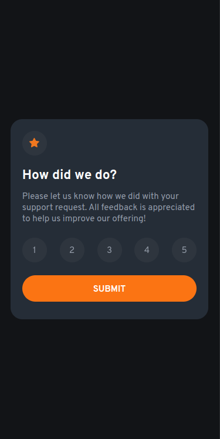
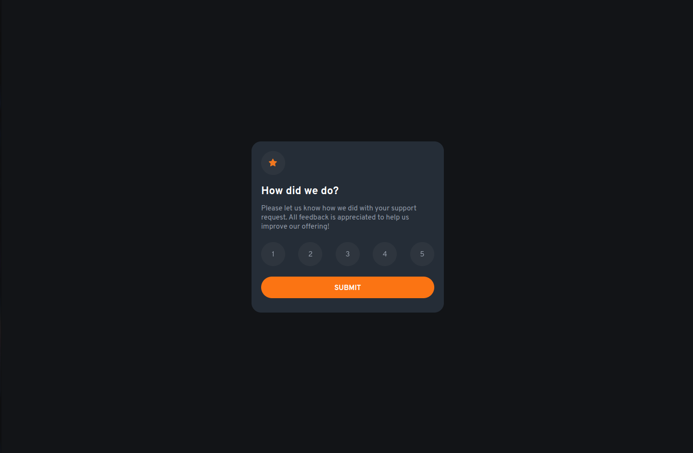

# Frontend Mentor - Interactive rating component solution
### Link: [Interactive Rating](https://main--coruscating-dolphin-ae7ce8.netlify.app/)
This is a solution to the [Interactive rating component challenge on Frontend Mentor](https://www.frontendmentor.io/challenges/interactive-rating-component-koxpeBUmI). Frontend Mentor challenges help you improve your coding skills by building realistic projects.

## Table of contents

- [Overview](#overview)
  - [The challenge](#the-challenge)
  - [Screenshot](#screenshot)
- [My process](#my-process)
  - [Built with](#built-with)
  - [What I learned](#what-i-learned)
- [Author](#author)

## Overview

### The challenge

Users should be able to:

- View the optimal layout for the app depending on their device's screen size
- See hover states for all interactive elements on the page
- Select and submit a number rating
- See the "Thank you" card state after submitting a rating

### Screenshot

## My process

### Built with

- [Angular](https://angular.io/) - Framework
- BEM
- Semantic HTML5 markup
- SCSS
- Flexbox
- Mobile-first workflow

### What I learned

- Accessibility
- Responsiveness

## Author

- GitHub - [gustavohenriquefs](https://github.com/gustavohenriquefs)
- Frontend Mentor - [@gustavohenriquefs](https://www.frontendmentor.io/profile/gustavohenriquefs)
- Instagram - [@gus_henriquefs](https://www.instagram.com/gus_henriquefs/)
- CodeForces - [gustavohenriquefs](https://codeforces.com/profile/gustavohenriquefs)
